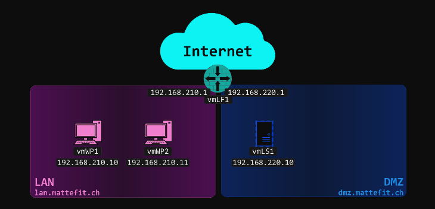

# bind9 als DNS server konfigurieren
## bind9 installieren
```bash
sudo apt install bind9
```
## Konfiguration
Unter /etc/bind wurden folgende Dateien erstellt:
```
named.conf
named.conf.default-zones
named.conf.local
named.conf.options
```

Für die Smartlearnumgebung wurden folgende Einstellungen in named.conf.options gemacht
```yaml
options{
    directory "/var/cache/bind";

    forwarders {
        1.1.1.1;
        9.9.9.9;
    };
    
    dnssec-validation auto;

    //IPv4
    listen-on port 53 {
        any;
    };

    allow-query {
        any;
    };

    allow-recursion {
        any;
    };

    listen-on-v6 { none; };
};
```

## Clients mit LS1 als DNS konfigurieren
WP1 wird im GUI konfiguriert.
LP1 wird auch im GUI konfiguriert.
LS1 kann nur per /etc/netplan konfiguriert werden.
Folgender Eintrag:
```yaml
network:
  version: 2
  renderer: networkd
  ethernets:
    eth0:
      addresses: [ 192.168.120.61/24 ]
      dhcp4: false
      routes:
        - to: default
          via: 192.168.120.2
      nameservers:
        addresses: [ 192.168.120.61 ]
        search: [ smartlearn.dmz ]
```

Damit die Änderung übernommen wird muss folgender Befehl noch ausgeführt werden
```bash
sudo netplan apply
```

## Fehlersuche
Fehler in der Konfiguration gibt Bind im Log aus, diese findet man unter /var/log/syslog

## Kommentare
Kommentare in der Konfigurationsdatei starten jeweils mit "//"

## Liste der Root-Server aktualisieren
Um eine aktuelle Liste der Root-Server unter db.root zu speichern, fragen wir einen Root-Server an
```bash
su

dig @a.root-servers.net | grep -E -v ';|^$' > /etc/bind/db.root
``` 

# DNS-Zonen einrichten
## Netwerküberssicht


## Zonendatei für die DMZ
### DMZ-Zone dmz.mattefit.ch
```yaml
;
; Zonendatei für dmz.mattefit.ch.
; /etc/bind/db.ch.mattefit.dmz
;
$TTL    3600
@       IN      SOA     vmls1.dmz.mattefit.ch.      root.mattefit.ch. (
                         1
                        1H
                        2H
                        1D
                        1H )

@       IN      NS      vmls1.dmz.mattefit.ch.
vmlf1   IN      A       192.168.120.1
vmls1   IN      A       192.168.120.10
```
```yaml
;
; Zonendatei für 120.168.192.in-addr.arpa.
; /etc/bind/db.192.168.120
;
$TTL    3600
@       IN      SOA     vmls1.dmz.mattefit.ch.      root.mattefit.ch. (
                         1
                        1H
                        2H
                        1D
                        1H )

@       IN      NS      vmls1.dmz.mattefit.ch.
1       IN      PTR     vmlf1.dmz.mattefit.ch.
10      IN      PTR     vmls1.dmz.mattefit.ch.
```
Damit die Zonen von unserem Bind gelesen werden müssen folgende Einträge in /etc/bind/named.conf.local
gemacht werden
```yaml
//
// DMZ
//
zone "dmz.mattefit.ch" {
        type master;
        notify no;
        file "/etc/bind/db.ch.mattefit.dmz";
};
zone "220.168.192.in-addr.arpa" {
        type master;
        notify no;
        file "/etc/bind/db.192.168.120";
};
```
# Weitere Zonen einrichten
## Zonen für das LAN
1. Eine Zone für den LAN-Bereich mit den Host LF1 und WP1 
2. Eine Eine Reverse Zone für den LAN-Bereich mit Records für die erwähnten Hosts

### lan.mattefit.ch zone
```yaml
;
; Zonendatei für lan.mattefit.ch.
; /etc/bind/db.ch.mattefit.lan
;
$TTL    3600
@       IN      SOA     vmwp1.lan.mattefit.ch.      root.mattefit.ch. (
                         1
                        1H
                        2H
                        1D
                        1H )

@       IN      NS      vmwp1.lan.mattefit.ch.
vmlf1   IN      A       192.168.110.1
vmwp1   IN      A       192.168.110.10
```
```yaml
;
; Zonendatei für 110.168.192.in-addr.arpa.
; /etc/bind/db.192.168.110
;
$TTL    3600
@       IN      SOA     vmwp1.lan.mattefit.ch.      root.mattefit.ch. (
                         1
                        1H
                        2H
                        1D
                        1H )

@       IN      NS      vmwp1.lan.mattefit.ch.
1       IN      PTR     vmlf1.lan.mattefit.ch.
10      IN      PTR     vmwp1.lan.mattefit.ch.
```
Eintrag in named.conf.local
```yaml
//
// LAN
//
zone "lan.mattefit.ch" {
        type master;
        notify no;
        file "/etc/bind/db.ch.mattefit.lan";
};
zone "110.168.192.in-addr.arpa" {
        type master;
        notify no;
        file "/etc/bind/db.192.168.110";
};
```

## Zonen für Mitarbeiter-Webseiten
### DNS-Zone "staff.mattefit.ch"
```yaml
//
// staff
//
zone "staff.mattefit.ch" {
    type master;
    file "/etc/bind/db.ch.mattefit.staff"
};
```
### Zonefile with CNAME and MX records
```yaml
;
; Zone file for staff.mattefit.ch
;
$TTL 3600   ; 1 hour (you can adjust this value as needed)

@   IN  SOA vmls1.dmz.mattefit.ch. root.mattefit.ch. (
    1       ; Serial number
    1H      ; Refresh
    2H      ; Retry
    1D      ; Expire
    1H )    ; Negative caching TTL

; Name server record
@   IN  NS  vmls1.dmz.mattefit.ch.

; CNAME records
henda   IN  CNAME vmls1.dmz.mattefit.ch.
admin   IN  CNAME vmls1.dmz.mattefit.ch.

; MX record for mail server
@   IN  MX  10  ex10.host-ed.mail.
```
