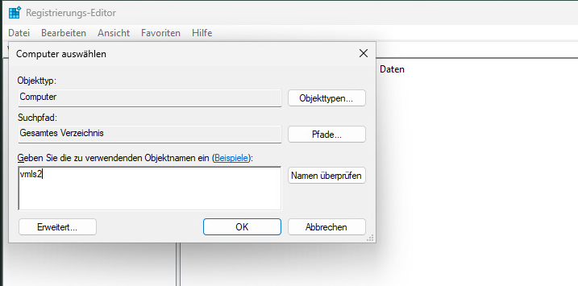
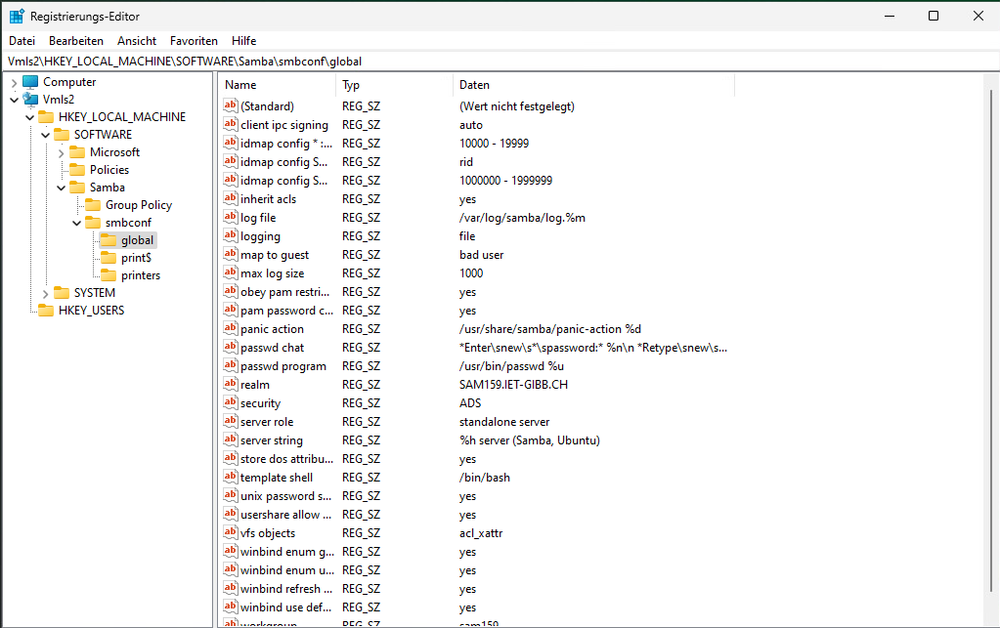

# AB01

## Setup ADDS mit Samba im Smartlearn Labor

| Server/Client Name | IP | Rolle |
|--------------------|----|-------|
| vmLS1 | 192.168.110.61 | Domain Controller | 
| vmLS2 | 192.168.110.62 | Domain Member Server |

## Installation und Konfiguration vmLS1

Als erstes wird die Search-Zone von LS1 unter `/etc/netplan/00-eth0.yaml` folgendermassen angepasst:


Damit der Domain Controller sich selber nach Namen kennt, wird der hostname in `/etc/hosts` eingetragen:


Anschliessend wird der Hostnamen in /etc/hostname angepasst:


Repositories und Packete aktualisieren, danach das Gerät Neustarten:

```bash
sudo apt update && sudo apt upgrade -y && sudo snap refresh -y && sudo reboot
```

### Samba installieren

```bash
sudo apt install samba smbclient heimdal-clients
```

Während der Installtion sollte es nach folgenden Informationen fragen:
- Kerberos Realm: SAM159.IET-GIBB.CH
- FQDN: vmLS1.sam159.iet-gibb.ch

Weitere Abhängikeiten installieren:

```bash
sudo apt install acl attr build-essential libacl1-dev libattr1-dev \
    libblkid-dev libgnutls28-dev libreadline-dev python2-dev python2 \
    python-dev-is-python3 python3-dnspython gdb pkg-config libpopt-dev \
    libldap2-dev libbsd-dev krb5-user docbook-xsl libcups2-dev ntp \
    ntpdate net-tools git winbind libpam0g-dev dnsutils lsof
```
Ein Backup vom samba-conf Datei erstellen:

```bash
mv /etc/samba/smb.conf /etc/samba/smb.conf.orig
```

### Samba als KCD für das Realm SAM159.IET-GiBB.CH einrichten

```bash
samba-tool domain provision
```
Die folgenden Eingaben eintragen


Dies reultiert in folgender Konfigurations-Datei


Da das DNS Dienst von samba zu Verfügung gestellt wird müssen wir das DNS-resolving ausschalten

```bash
sudo systemctl disable systemd-resolved && sudo systemctl stop systemd-resolved
sudo cp /etc/resolv.conf resolv.conf.backup
sudo rm /etc/resolv.conf
```
Danach ein eigenes resolv.conf erstellen mit folgenden Eintrag:

```bash
nameserver 192.168.110.61
search sam159.iet-gibb.ch
```

Samba systemd-service starten

```bash
sudo systemctl unmask samba-ad-dc
sudo systemctl enable samba-ad-dc
sudo systemctl start samba-ad-dc
```
Aber dies resultiert in ein Fehler da der Service nicht exisitiert. Ich erstelle ihn selbst unter /etc/systemd/system/samba-ad-cd.service folgendermassen:


Danach die vorherigen Befehle nochmals ausführen.

Samba konfigurieren für die Benutzung des Kerberos-Authentifizierungsdienst unter /etc/krb5.conf


Netzwerk testen

```bash
sudo systemctl start systemd-resolved
sudo resolvectl status
```


und systemd-resolve wieder ausschalten:

```bash
sudo systemctl stop systemd-resolved
```

DNS-Service von samba aktualisieren

```bash
samba_dnsupdate --verbose
```

Reverse Lookup-Zone per samba-tool einrichten:

```bash
# Zone kreieren
samba-tool dns zonecreate vmLS1 110.168.192.in-addr.arpa -Uadministrator
# Reverse Lookup Zone einrichten
samba-tool dns add 192.168.110.61 110.168.192.in-addr.arpa 61 PTR vmLS1.sam159.iet-gibb.ch -U administrator
```
### A und PTR Records eintragen

A record für vmls2:

```bash
samba-tool dns add vmLS1.sam159.iet-gibb.ch sam159.iet-gibb.ch vmLS2 A 192.168.110.62 -U administrator
```

Pointer-Record in Reverse-Zone für vmls2:

```bash
samba-tool dns add vmLS1.sam159.iet-gibb.ch 110.168.192.in-addr.arpa 63 PTR vmLS2.sam159.iet -U administrator
```

A record für vmlp1:

```bash
samba-tool dns add vmLS1.sam159.iet-gibb.ch sam159.iet-gibb.ch vmLP1 A 192.168.110.30 -U administrator
```

Pointer-Record in Reverse-Zone für vmlp1:

```bash
samba-tool dns add vmLS1.sam159.iet-gibb.ch 110.168.192.in-addr.arpa 30 PTR vmLP1.sam159.iet -U administrator
```

## 4.1

```bash
sudo netstat -tlpn
```
! Achtung je nach installtion werden andere Ports verwendet !

Folgend die Standard Ports

445: KDC
389: LDAP
636: LDAPS (LDAP over SSL)
88: Kerberos authentication protocol
53: DNS

## 4.2
Ticket lösen für user administrator
```bash
kinit administrator@SAM159.IET-GIBB.CH
```

Ticket kontrollieren
```bash
klist
```


## 4.5

Die authentifizierung ist nicht erfolgreich


## 4.6

```bash
sudo samba-tool domain passwordsettings set --complexity=off
sudo samba-tool domain passwordsettings set --history-length=0
sudo samba-tool domain passwordsettings set --min-pwd-age=0
sudo samba-tool domain passwordsettings set --max-pwd-age=0
sudo samba-tool user setexpiry Administrator --noexpiry
```

## 4.7

A Record anlegen

```bash
samba-tool dns add vmls1.sam159.iet-gibb.com sam159.iet-gibb.ch host1 A 192.168.110.100 -U administrator
```

PTR Record anlegen

```bash
samba-tool dns add vmls1.sam159.iet-gibb.ch 110.168.192.in-addr.arpa 110.168.192 PTR host1 -U administrator
```

## 4.8

A Record löschen

```bash
samba-tool dns delete vmls1.sam159.iet-gibb.ch sam159.iet-gibb.ch host1 A 192.168.110.100 -U administrator
```
## 4.9

FSMO - Flexible Single Master Operations

NT Windows Directory Service -> Windows NT Architektur

# AB03

## Domäne mit vmWP1 beitreten

Controlpanel > Arbeitsgruppe > Domäne Eintragen

Anmelden mit username SAM159\administrator

## Linux Fileserver auf vmLS2

### Netzwerk auf vmLS2 einrichten

Backup vom `/etc/netplan/00-eth0.yaml`

```bash
cp /etc/netplan/00-eth0.yaml /etc/netplan/00-eth0.yaml.backup
```

Nameserver und Zone einrichten:

```yaml
nameservers:
  addresses: [ 192.168.110.61 ]
  search: [ m159.iet-gibb.ch ]
```

Config aktivieren:
```bash
sudo netplan apply
```

### Samba auf vmLS2 installieren

```bash
sudo apt install -y samba samba-common-bin smbclient heimdal-clients libpam-heimdal libnss-winbind libpam-winbind
```

Während der installation konnte nichts konfiguriert werden

Grundkonfiguration des Fileservers

Erstelle  folgende Einträge in `/etc/samba/smb.conf`

```yaml
[ global ]
    workgroup = sam159
    realm = SAM159 . IET - GIBB . CH
    security = ADS
    winbind enum users = yes
    winbind enum groups = yes
    winbind use default domain = yes
    winbind refresh tickets = yes
    template shell = / bin / bash
    idmap config * : range = 10000 - 19999
    idmap config SAM159 : backend = rid
    idmap config SAM159 : range = 1000000 - 1999999
    inherit acls = yes
    store dos attributes = yes
    client ipc signing = auto
    vfs objects = acl_xattr
```

### vmLS2 als Mitglied zur Domäne hinzufügen

```bash
net ads join -Uadministrator
```
Überprüfen ob AD Benutzer und Gruppen übernommen wurden

```bash
wbinfo -u # Benutzer
wbinfo -g # Gruppen
```

Falls ein Fehler beim Ausführen der Befehle entsteht, starte den winbind service neu

```bash
sudo systemctl restart winbind
```

### Konfiguration winbind

Damit Rechte an Benutzer für die Dateisystem vergeben werden kann erstelle folgende Einträge in `/etc/nsswitch.conf`

```bash
passwd:     compat systemd winbind
group:      compat systemd winbind
shadow:     compat winbind
```

Kontrollieren ob die Konfiguration übernommen wurde:

```bash
getent passwd
getent groups
```

### 3.1

Ich kann zur Domäne Adminitrator einwandfrei per `su administrator` wechseln...
Arbeitsblatt ist potenntiell veraltet...

### 3.2

Mit dem RSAT-Tool ein Benutzer und Gruppe erstellen:

Auf vmLS1

```bash
sudo samba-tool group add test
sudo samba-tool user add testuser1
```

Benutzer zur Gruppe hinzufügen

```bash
sudo samba-tool group addmembers test testuser1
```

### 3.3

Objekte im LDAP auflisten -> `ldap-utils`

```bash
ldapsearch -x -H ldap://127.0.0.1 -D "cn=administrator,dc=sam159,dc=iet-gibb,dc=ch" -W -b "dc=sam159,dc=iet-gibb,dc=ch" "(objectClass=*)"
```

# AB04

## Registry verwenden zum Konfigurieren

### Registry zugriff auf vmWP1 einstellen

Als erstes fügen wir auf vmWP1 die Registry von vmLS2 zu, öffne regedit > Datei > Mit Netzwerkregistrierung verbinden



anschliessend auf OK clicken

### smb.conf in die Registry verschieben

Auf vmLS2 folgender Befehl ausführen:

```bash
sudo net conf import /etc/samba/smb.conf
```

Kontrollieren ob es importiert wurde

```bash
sudo net conf list
```

## 2.2

Navigiere im Registry > Vmls2 > HKEY_LOCAL_MACHINE > SOFTWARE > Samba > smbconf > global, etc



## 2.3

smb.conf wird zu smb.conf.master umbennent

```bash
sudo cp smb.conf smb.conf.master
```
Folgende Zeile im [ global ] von smb.conf hinzufügen: `config backend = registry` alles andere weg!

!!! Nicht importieren !!!

## 2.4

`sudo testparm`

# AB05

## Shares erstellen auf vmLS2

```bash
sudo mkdir -p /daten/reg-share
sudo net conf addshare reg-share /daten/reg-share writeable=yes guest_ok=n "Share in der Registry"
```

Share auflisten

```bash
smbclient -L vmls2
```

## 2.3

Keine Berechtigung

