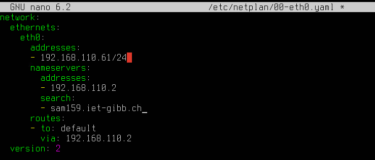
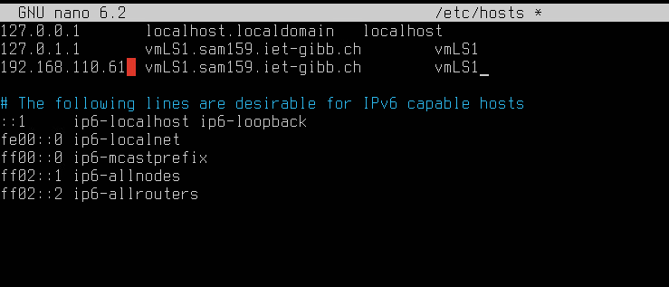
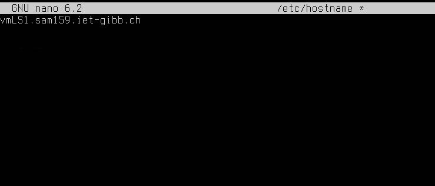
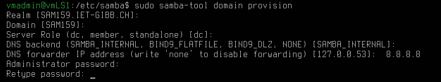
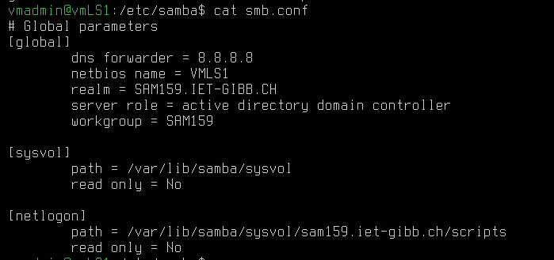
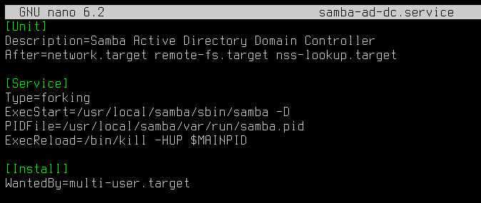
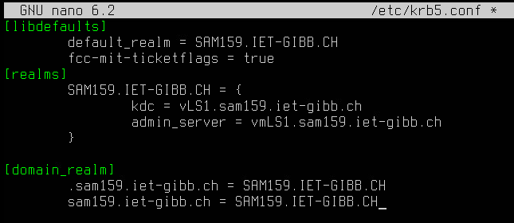
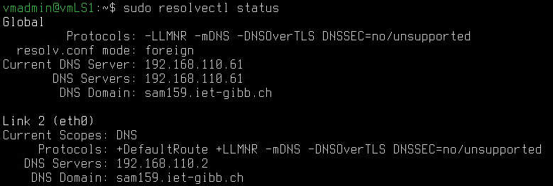
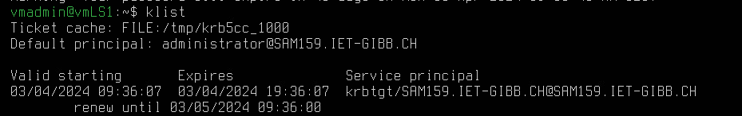
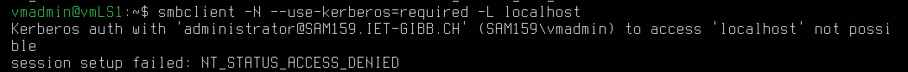

# Setup ADDS mit Samba im Smartlearn Labor

| Server/Client Name | IP | Rolle |
|--------------------|----|-------|
| vmLS1 | 192.168.110.61 | Domain Controller | 
| vmLS2 | 192.168.110.62 | Domain Member Server |

# Installation und Konfiguration vmLS1
Als erstes wird die Search-Zone von LS1 unter `/etc/netplan/00-eth0.yaml` folgendermassen angepasst:



Damit der Domain Controller sich selber nach Namen kennt, wird der hostname in `/etc/hosts` eingetragen:



Anschliessend wird der Hostnamen in /etc/hostname angepasst:



Repositories und Packete aktualisieren, danach das Gerät Neustarten:
```bash
sudo apt update && sudo apt upgrade -y && sudo snap refresh -y && sudo reboot
```
## Samba installieren
```bash
sudo apt install samba smbclient heimdal-clients
```
Während der Installtion sollte es nach folgenden Informationen fragen:
- Kerberos Realm: SAM159.IET-GIBB.CH
- FQDN: vmLS1.sam159.iet-gibb.ch

Weitere Abhängikeiten installieren:
```bash
sudo apt install acl attr build-essential libacl1-dev libattr1-dev \
    libblkid-dev libgnutls28-dev libreadline-dev python2-dev python2 \
    python-dev-is-python3 python3-dnspython gdb pkg-config libpopt-dev \
    libldap2-dev libbsd-dev krb5-user docbook-xsl libcups2-dev ntp \
    ntpdate net-tools git winbind libpam0g-dev dnsutils lsof
```
Ein Backup vom samba-conf Datei erstellen:
```bash
mv /etc/samba/smb.conf /etc/samba/smb.conf.orig
```
## Samba als KCD für das Realm SAM159.IET-GiBB.CH einrichten
```bash
samba-tool domain provision
```
Die folgenden Eingaben eintragen



Dies reultiert in folgender Konfigurations-Datei



Da das DNS Dienst von samba zu Verfügung gestellt wird müssen wir das DNS-resolving ausschalten
```bash
sudo systemctl disable systemd-resolved && sudo systemctl stop systemd-resolved
sudo cp /etc/resolv.conf resolv.conf.backup
sudo rm /etc/resolv.conf
```
Danach ein eigenes resolv.conf erstellen mit folgenden Eintrag:
```bash
nameserver 192.168.110.61
search sam159.iet-gibb.ch
```
Samba systemd-service starten
```bash
sudo systemctl unmask samba-ad-dc
sudo systemctl enable samba-ad-dc
sudo systemctl start samba-ad-dc
```
Aber dies resultiert in ein Fehler da der Service nicht exisitiert. Ich erstelle ihn selbst unter /etc/systemd/system/samba-ad-cd.service folgendermassen:



Danach die vorherigen Befehle nochmals ausführen.

Samba konfigurieren für die Benutzung des Kerberos-Authentifizierungsdienst unter /etc/krb5.conf



Netzwerk testen
```bash
sudo systemctl start systemd-resolved
sudo resolvectl status
```


und systemd-resolve wieder ausschalten:
```bash
sudo systemctl stop systemd-resolved
```
DNS-Service von samba aktualisieren
```bash
samba_dnsupdate --verbose
```
Reverse Lookup-Zone per samba-tool einrichten:
```bash
# Zone kreieren
samba-tool dns zonecreate vmLS1 110.168.192.in-addr.arpa -Uadministrator
# Reverse Lookup Zone einrichten
samba-tool dns add 192.168.110.61 110.168.192.in-addr.arpa 61 PTR vmLS1.sam159.iet-gibb.ch -U administrator
```
### A und PTR Records eintragen
A record für vmls2:
```bash
samba-tool dns add vmLS1.sam159.iet-gibb.ch sam159.iet-gibb.ch vmLS2 A 192.168.110.62 -U administrator
```
Pointer-Record in Reverse-Zone für vmls2:
```bash
samba-tool dns add vmLS1.sam159.iet-gibb.ch 110.168.192.in-addr.arpa 63 PTR vmLS2.sam159.iet -U administrator
```
A record für vmlp1:
```bash
samba-tool dns add vmLS1.sam159.iet-gibb.ch sam159.iet-gibb.ch vmLP1 A 192.168.110.30 -U administrator
```
Pointer-Record in Reverse-Zone für vmlp1:
```bash
samba-tool dns add vmLS1.sam159.iet-gibb.ch 110.168.192.in-addr.arpa 30 PTR vmLP1.sam159.iet -U administrator
```

# AB01

## 4.1

```bash
sudo netstat -tlpn
```
445: KDC
389: LDAP
636: LDAPS (LDAP over SSL)
88: Kerberos authentication protocol
53: DNS

## 4.2
Ticket lösen für user administrator
```bash
kinit administrator@SAM159.IET-GIBB.CH
```

Ticket kontrollieren
```bash
klist
```


## 4.5

Die authentifizierung ist nicht erfolgreich



## 4.6

```bash
sudo samba-tool domain passwordsettings set --complexity=off
sudo samba-tool domain passwordsettings set --history-length=0
sudo samba-tool domain passwordsettings set --min-pwd-age=0
sudo samba-tool domain passwordsettings set --max-pwd-age=0
sudo samba-tool user setexpiry Administrator --noexpiry
```

# 

