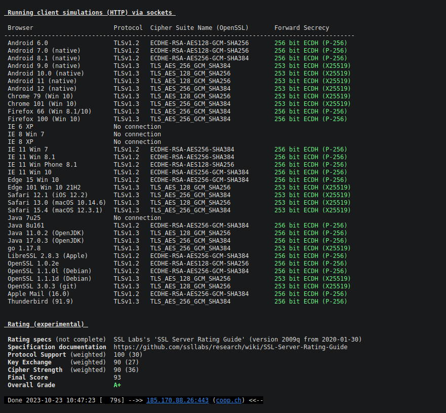
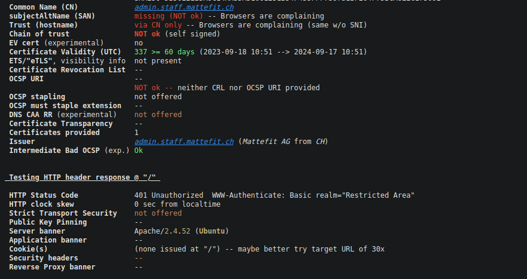

## TLS Audit
Um die TLS Zertifikate und Konfiguration zu prüfen können Anbieter wit Qualys SSL Labs benutzt werden.

Beispiel mit coop.ch


## Offline TLS Audit
Müssen Seiten getestet werden welche nicht im Internet öffentlich stehen, so kommen die Online-Tools nicht in Frage.
Als Beispiel verwenden wir den Skript testssl.sh welches auf Github verfügbar ist und testen damit unsere Installation.

### testssl.sh
Zuerst wird das Tool von github geklont.
```bash
git clone https://github.com/drwetter/testssl.sh.git
```
Danach müssen die Berechtigungen mit chmod angepasst werden damit es ausgeführt werden kann.
```bash
sudo chmod +x testssl.sh
```
Hier wieder das Beispiel coop.ch, diesmal mit ssltest.sh




Beim gleichen Test erhaltet der adminbereich von mattefit ein "T" als Bewertung. Dies liegt dem Zugrunde, dass wir ein Self-signed Zertifikat benutzt haben. 



### Konfigurationsdatei TLS 1.2
Konfigurationsdatei erstellen
```bash
sudo nano /etc/apache/conf-available/mattefit_ssl.conf
```
Folgende Zeilen hinzufügen und abspeichern
```bash
# TLS Version anpassen
SSLProtocol -ALL +TLSv1.2
```
SSLProtocol -ALL +TLSv1.2: Diese Zeile legt die TLS-Protokollversionen fest, die der Apache-Server unterstützt. TLS (Transport Layer Security) ist ein Verschlüsselungsprotokoll, das für sichere Datenübertragung im Internet verwendet wird. In dieser Konfiguration werden zunächst alle vorhandenen Protokollversionen deaktiviert (-ALL), und dann wird nur TLS 1.2 (+TLSv1.2) aktiviert.

### HSTS aktivieren
HTTP Strict Transport Security wird folgendermassen aktiviert: Diese Zeile muss im Konfigurationsdatei hinzugefügt werden:
```bash
Header always set Strict-Transport-Security "max-age=31536000; includeSubDomains; preload"
```
- Header always set Strict-Transport-Security: Hier wird HSTS aktiviert
- max-age: Der Header darf ein maximales alter von 1 Jahr haben
- includeSubdomains: Subdomänen sind miteinbegriffen
- preload: Die Seite wird in der Browser-HSTS-Liste preloaded

### SAN
Subject Alternative Names ist ein Apache-SSL-Zertifikat, welches generiert oder eingeholt werden muss:

    Schlüssel erstellen mit openssl req -new -newkey rsa:2048 -nodes -keyout mattefit_admin.key -out mattefit_admin.csr
    Zertifikat installieren, in dem dass man es in das Directory `` legt
    Apache-Konfiguration /etc/apache2/sites-available/ch.mattefit.admin_ssl.conf anpassen. Dort, wo die SSL-Keys festgelegt sind, wird neu auf die SAN-Keys gezeigt.
```
# Pfade zu SSL-Zertifikaten mit SAN-Einträgen
SSLCertificateFile /etc/ssl/ch.mattefit.admin_san.crt
SSLCertificateKeyFile /etc/ssl/ch.mattefit.admin_san.key
```

### Nur Empfohlene Verschlüsselungen
Dies wird im Konfigurationdatei mit folgender Zeilen gelöst:
```bash
SSLEngine on
SSLProtocol -ALL +TLSv1.2
SSLCipherSuite "TLS_AES_128_GCM_SHA256:TLS_AES_256_GCM_SHA384:TLS_CHACHA20_POLY1305_SHA256:ECDHE-RSA-AES128-GCM-SHA256:ECDHE-RSA-AES256-GCM-SHA384"
```

## Apache-Config Anpassungen - Hardening
Ein weiterer Konfigurationsdatei wird erstellt: /etc/apache2/conf-available/mattefit_hardening.conf
### Informationen einschränken
Die Kommunikationstätigkeit des Webservers can mit folgenden Zeilen eingeschränkt werden:
```bash
ServerTokens Apache
ServerSignature Off
```
### Etag deaktivieren
Etag verbessert das Verhalten vom Cache , jedoch kann es auch eine Sicherheitslücke sein, da es Informationen über das OS verratet.
```bash
FileEtag None
```
### Benutzer Einschränken
Benutzer können mit dem .htaccess Dateien Funktionen des Webservers steuern ohne zugriff auf die Konfigurationsdateien zu haben. Dies sollte eingeschränkt werden.
```bash
AllowOverride None
```  
### http-Verben einschränken
Für die meisten Webseiten werden nur die Verben GET, POST und HEAD benötigt, deswegen schränken wir sie auf diese ein.
```html
<LimitExcept GET POST HEAD>
deny from all 
</LimitExcept>
```
### Timeout setzen
Um DDoS attacken vorzubeugen kann der Timeout von ungebrauchten verbindungen von 300 auf 60s gekürzt werden
```bash
Timeout 60
```

## Logdateien Analysieren
### Installation von goaccess
```bash
sudo apt install goaccess
```

### goaccess starten
Zuerst navigieren wir zum Verzeichnis indem apache2 die accesslogs ablegt. In diesem Fall ist es /var/log/apache2. Hier finden wir eine Datei namens
1slmv_access.log
```bash
goaccess 1slmv_access.log
```
Ich wähle NCSA Combined Log Format, lasse alles andere Default.


