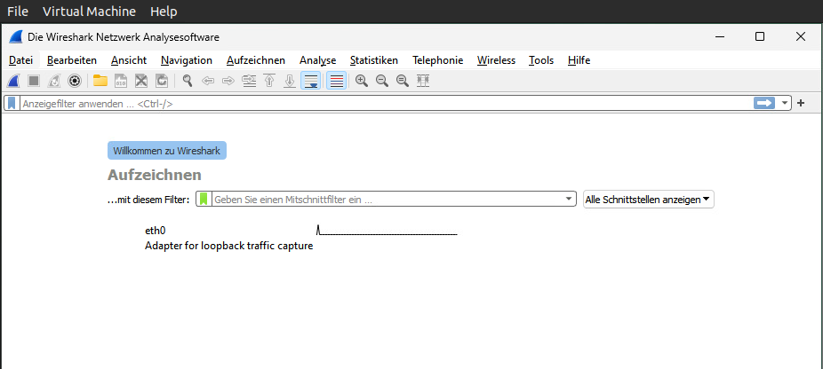
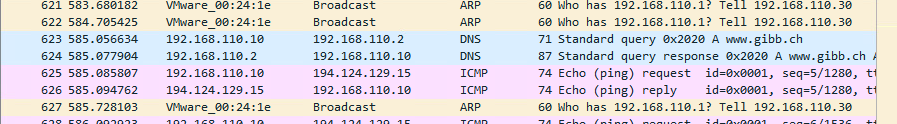
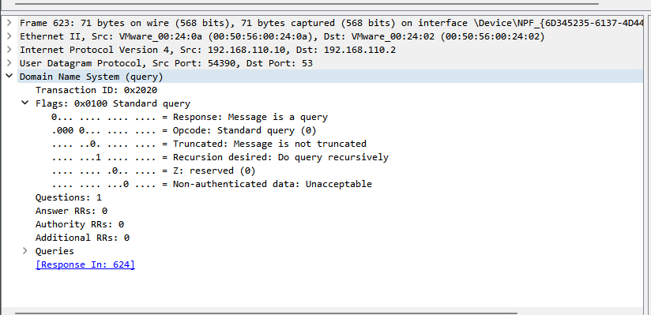
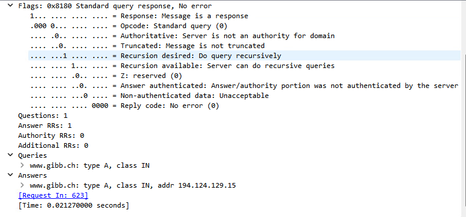

# Wireshark

## Aufzeichnung starten

Beim öffnen von Wireshark begegnet man folgender Fenster:



Hier wird der Netzwerkadapter ausgewählt mit welcher die Packete aufgezeichnet werden sollten. In unserem Fall ist es ```eth0```

In der Kommandozeile werden als Beispiel jetzt folgende Befehle ausgeführt:

```cmd
ipconfig /flushdns
ping www.gibb.ch
```

Gleich danach wird die Aufzeichnung in Wireshark mit CTRL+E pausiert. Relevant sind die Einträge ```Standard query``` und ```Standard query response```



## Packete untersuchen

Als erstes schauen wir uns den Eintrag ```Standard query``` an.



Hier die ```Standard query response```



DNS (Domain Name System) arbeitet auf der Anwendungsschicht (Ebene 7) des OSI-Modells und nicht auf Ebene 3. Das OSI-Modell besteht aus sieben Schichten, nämlich:

1. Physikalische Schicht
2. Sicherungsschicht
3. Vermittlungsschicht
4. Transportschicht
5. Sitzungsschicht
6. Darstellungsschicht
7. Anwendungsschicht

DNS ist dafür zuständig, menschenlesbare Domänennamen (wie z. B. www.beispiel.com) in IP-Adressen umzuwandeln, die Computer verwenden können, um über das Netzwerk zu kommunizieren. Da dies die Übersetzung von aussagekräftigen Namen in Netzwerkadressen betrifft, fällt es in den Bereich der Anwendungsschicht, die Netzwerkdienste direkt für Endbenutzer oder Anwendungen bereitstellt. DNS-Anfragen werden innerhalb von Protokollen wie UDP (User Datagram Protocol) oder TCP (Transmission Control Protocol) verschachtelt, die Transportprotokolle sind (Ebene 4), die wiederum auf der Vermittlungsschicht (Ebene 3) aufsetzen.
